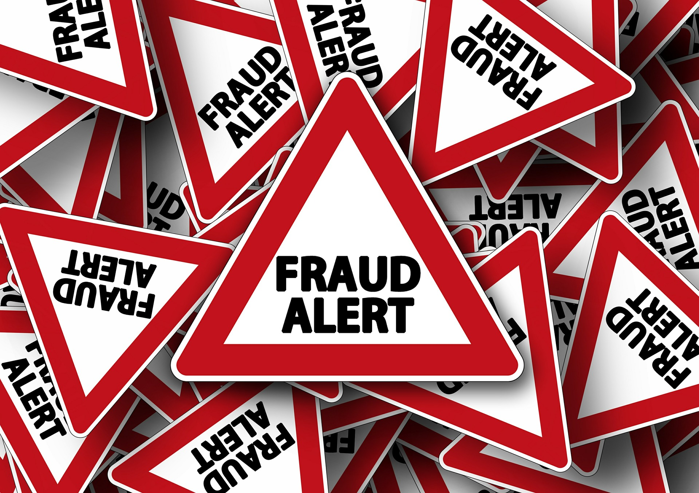
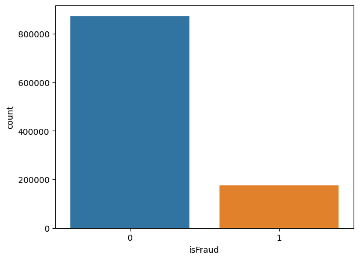
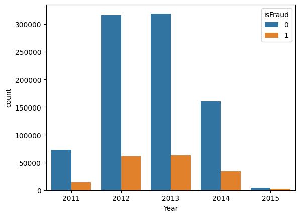
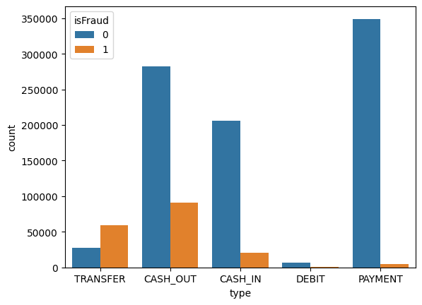
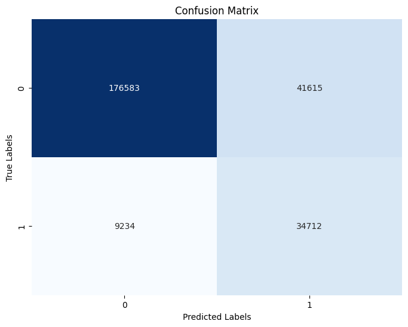
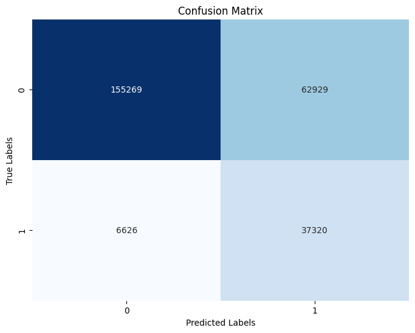
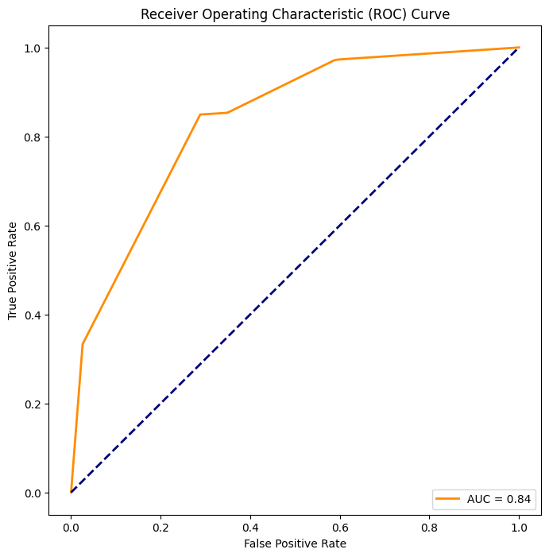

## <ins> Customer fraud prediction </ins>

Banks and financial institutions alike suffer from the possibility of fraudulent transactions. This is a very major draw-back because it paints a bad image to major financial institutions. One major way to address the fraud transaction draw-back is developing machine learning models that may help in flagging fraud transactions. Machine learning models dive deeper into analyzing the data an deriving meaningful insights. 

## <ins> Data analysis </ins>

Dealing with fraud classification problems suffers from class imbalance(**The fraud transactions are always less**). Without addressing the class imbalance, the ML model may have bias and may classify fraud transactions as non-fraud. This poses a very major security threat as it may be exploited by credit card scammers knowing very well they are evading the systems put in place. 

The below bar plot shows the fraud distribution across various credit cards commonly abused for fraud transactions. 

Analysis on years mostly affected by fraud.

Analysis for the type of transaction commonly use for fraud. 

## <ins> Modelling </ins>

One way of dealing with class imbalance in the data is using **Oversampling** or **Undersampling** techniques. This work sby generating synthetic samples for the minority class represented by the fraud transactions One major drawback of using oversampling techniques is it may lead to overfitting and therefore perform poorly in th eproduction stage. It should be done with care. 

Using the various logistic regression models, the best model among them is the **XG Boost** model which performs way better than all the other models. Our main goal is minimizing the number of **False negatives(Fraud transactions classified as non-fraud)**. With tuning of the model's parameters, this score can be greatly minimized. 

Before tuning:
  

After tuning:

  

The model has an **AUC** score of above **0.5** which is one signal that the model performs better. 

## <ins> Future steps </ins>

One of the steps to be taken later is the model deployment and close monitoring to ensure fraud transactions are weeded out in due time efficiently. 
